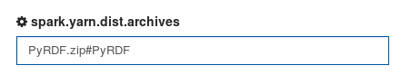
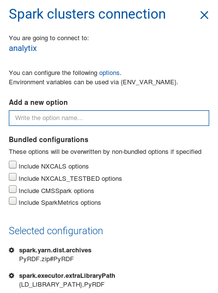

# PyRDF Demos

The following demos are available in SWAN:

- [ROOT df102 Tutorial](df102_NanoAODDimuonAnalysis.ipynb): NanoAOD Dimuon Analysis <a href="https://cern.ch/swanserver/cgi-bin/go?projurl=https://github.com/JavierCVilla/PyRDF/blob/master/demos/df102_NanoAODDimuonAnalysis.ipynb" target="_blank">
</a>

- [RDF Demo](RDF_demo.ipynb): Dimuon invariant mass spectrum plot <a href="https://cern.ch/swanserver/cgi-bin/go?projurl=https://github.com/JavierCVilla/PyRDF/blob/master/demos/RDF_demo.ipynb" target="_blank">
</a>

## How to use PyRDF with Spark in SWAN

**Disclaimer**: This process will be much simpler once we integrate PyRDF as part of the LCG Releases. Our goal is to add the next [0.1.0 release version](https://github.com/JavierCVilla/PyRDF/projects/2).

1. Open a terminal in SWAN:

  

2. Go to your project folder:

  ```
  cd SWAN_projects/<Project_PATH>
  ```

3. Clone the PyRDF repository from Github:

  ```
  git clone https://github.com/JavierCVilla/PyRDF
  ```

4. Since PyRDF is not distributed yet through CVMFS, we need to send it to our remote workers. The next command creates a zip file with the content of the module:

  ```
  python PyRDF/demos/swan-setup.py
  ```

5. Go back to your notebook and open the menu to connect to a Spark cluster:

 

6. Before starting the connection, let's add some configuration to the SparkContext:

  ```
  {
    "name": "spark.executor.extraLibraryPath",
    "value": "{LD_LIBRARY_PATH},PyRDF"
  },
  {
    "name": "spark.yarn.dist.archives",
    "value": "PyRDF.zip#PyRDF"
  }
  ```

  This can be added using the SWAN interface as follows:

  Enter the name of the parameter on the _Add new option_ field:

  

  And the value:

  

  Same for the second parameter:

  

  

  Once both parameters have been configured, the menu should look like this:

  

7. Now we are ready to connect to the cluster.

8. Select the Spark backend in PyRDF, by default PyRDF will use the `Local` backend which is equivalent to RDataFrame running in a local machine.

  ```
  PyRDF.use("spark", {'npartitions': '32'})
  ```

  The second parameter of `PyRDF.use` allows us to add some configuration to the Spark context such as the number of partitions, modify this number to suit your needs.

9. Have a look at the demos to see example of use.
