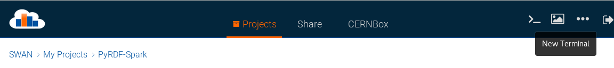
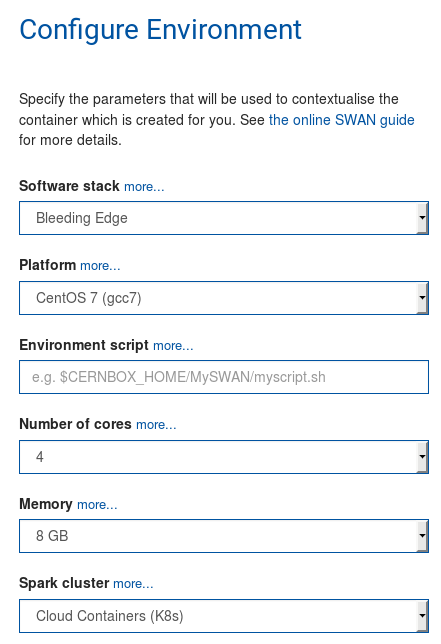
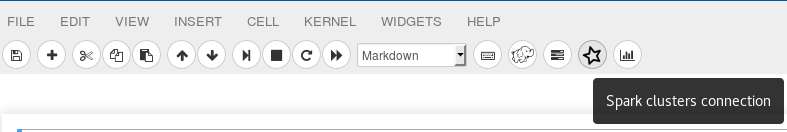
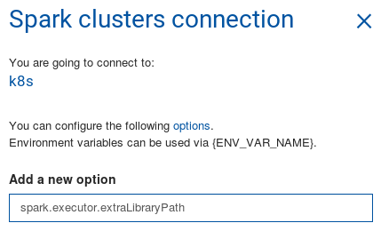
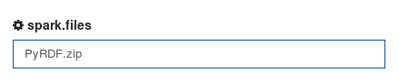
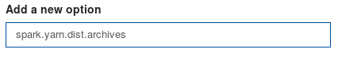

# PyRDF Demos

The following demos are available in SWAN:

| Title  | Content  | Link to SWAN |
|--------|----------|--------------|
| [ROOT df102 Tutorial](df102_NanoAODDimuonAnalysis.ipynb) |  NanoAOD Dimuon Analysis |  <a href="https://cern.ch/swanserver/cgi-bin/go?projurl=https://raw.githubusercontent.com/JavierCVilla/PyRDF/new-demo/demos/df102_NanoAODDimuonAnalysis.ipynb" target="_blank"></a> |
| [RDF Demo](RDF_demo.ipynb) | Dimuon invariant mass spectrum plot | <a href="https://cern.ch/swanserver/cgi-bin/go?projurl=https://raw.githubusercontent.com/JavierCVilla/PyRDF/new-demo/demos/RDF_demo.ipynb" target="_blank"></a> |

Since release [0.1.0](https://github.com/JavierCVilla/PyRDF/releases/tag/v0.1.0) PyRDF is part of the [LCG Releases](http://lcginfo.cern.ch/pkg/PyRDF/). This means that you can use it on SWAN straight away via `import PyRDF` in a notebook. If you developed your custom PyRDF version, or you want to use the very latest features we provide, the next paragraph will show you how to do that.

## Custom PyRDF on SWAN HOW-TO

#### 1. Enter to [SWAN](swan.cern.ch)

#### 2. Open a terminal in SWAN:

  

#### 3. Go to your project folder:

  ```
  cd SWAN_projects/<Project_PATH>
  ```

#### 4. Clone the PyRDF repository from Github:

  ```
  git clone https://github.com/JavierCVilla/PyRDF
  ```

#### 5. Go to PyRDF main directory:

  ```
  cd PyRDF
  ```

#### 6. Install PyRDF in your current SWAN session:

  ```
  python setup.py install --user
  ```

#### 7. Go back to your project directory:

  ```
  cd ../
  ```

#### 8. (optional) If you are going to work with Spark, PyRDF needs to be sent to the remote workers as well. The next command creates a zip file with the content of the module:

  ```
  python PyRDF/demos/swan-setup.py
  ```

#### 9. You can now go to your notebook. Type the following in the first cell:

  ```python
  import sys
  # Tell python to first look for PyRDF in this folder
  # otherwise it will pick up the LCG Releases package.
  sys.path.insert(0, "path/to/custom/PyRDF")
  import PyRDF
  ```

#### 10. Proceed with your analysis as usual.

## Connecting to the Spark Cluster on SWAN with PyRDF

#### 1. Enter to [SWAN](swan.cern.ch)

#### 2. Select the *Cloud Containers* Spark cluster in your configuration and the *Bleeding Edge* Software stack.

<p align="center"></p>

#### 3. Open your notebook and click on the menu to connect to a Spark cluster:

 

#### 4. (optional) If you want to ship a custom version of PyRDF to the workers, provided you followed the steps in the previous [section](#custom-pyrdf-on-swan-how-to), you should configure the SparkContext as follows:

  ```
  "sparkconnect": {
      "bundled_options": [],
      "list_of_options": [
        {
          "name": "spark.files",
          "value": "PyRDF.zip"
        }
      ]
    }
  ```

  This can be added using through the SWAN interface:

  - Enter the name of the parameter on the _Add new option_ field:

      <p align="center"></p>

  - And add the value:

      <p align="center"></p>

  - Once the parameter has been configured, the menu should look like this:

      <p align="center"></p>

#### 5. Click on the button at the bottom of the Spark menu to connect to the cluster.

#### 6. Select the Spark backend in PyRDF, by default PyRDF will use the `Local` backend which is equivalent to RDataFrame running in a local machine.

  ```python
  # Configure PyRDF to run on Spark splitting the dataset into 32 partitions
  PyRDF.use("spark", {'npartitions': '32'})
  ```

  The second parameter of `PyRDF.use` allows us to add some configuration to the Spark context such as the number of partitions, modify this number to suit your needs.

#### 7. (optional) Type the following in a cell to ship your custom PyRDF to the Spark workers during the analysis:

  ```python
  # Add python module (temporal)
  sc.addPyFile("./PyRDF.zip")
  ```

#### 8. Have a look at the [demos](#pyrdf-demos) to see examples of use.
